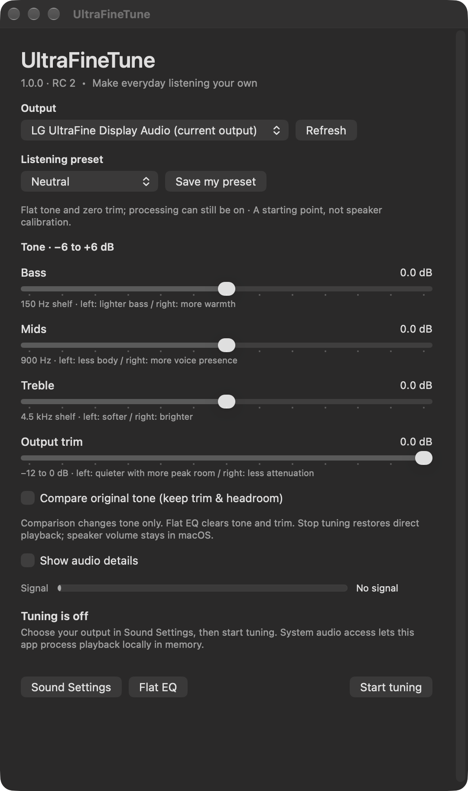

# UltraFineTune

A free, open-source macOS system audio equalizer with listening presets and bass, mids, treble, and output trim controls. Use it with a supported stereo physical output, including LG UltraFine speakers, selected as your Mac’s default output.

[Download 1.0.1](https://github.com/fcw1987/UltraFineTune/releases/tag/v1.0.1) · [Website](https://fcw1987.github.io/UltraFineTune/) · [Get started](docs/BUILD.md) · [Support](https://github.com/fcw1987/UltraFineTune/issues) · [Privacy](docs/PRIVACY.md) · [MIT license](LICENSE)



Adjust bass, mids, treble, and output trim without a driver or third-party runtime. Choose a gentle listening preset, save your own, and compare the original tone from the menu bar. There are no subscriptions, paid tiers, accounts, or activation keys.

## Download and try it

Download the [1.0.1 app ZIP for Apple silicon (arm64)](https://github.com/fcw1987/UltraFineTune/releases/download/v1.0.1/UltraFineTune-1.0.1-macos-arm64.zip) from [GitHub Releases](https://github.com/fcw1987/UltraFineTune/releases/tag/v1.0.1). Requires **macOS 14.2+**. The ZIP includes the app, MIT license, and installation guide; a SHA-256 checksum is available with the release.

Extract the ZIP, quit any older copy, and open `UltraFineTune.app`. You can move it to your user’s Applications folder. This release is **Developer ID signed and Apple notarized**, with hardened runtime, a secure timestamp, and a stapled notarization ticket. Open the downloaded app normally and confirm macOS’s first-open prompt. System audio capture permission is a separate approval when you start tuning. Building from source is also available.

## Build from source

Requires **macOS 14.2+** and Xcode or Apple Command Line Tools with an SDK supporting Core Audio process taps. The build uses Apple frameworks and in-tree C/Objective-C source.

```sh
git clone https://github.com/fcw1987/UltraFineTune.git
cd UltraFineTune
bash build.sh
open dist/UltraFineTune.app
```

1. Select your stereo output in **System Settings → Sound → Output**, then select the same output in UltraFineTune. It must already be the Mac’s default physical output.
2. Click **Start tuning** and approve macOS system audio capture permission if requested.
3. Play familiar audio at a comfortable volume. Begin with **Neutral** and make small adjustments by ear.
4. Use **Compare original tone** to remove tone adjustments while keeping trim and reserved headroom. **Stop tuning** returns to ordinary playback.

Every launch begins with tuning off. Route changes and sleep stop tuning; confirm your output and restart manually. The app does not change hardware volume or the Mac’s default output.

## Choose a starting point

| Preset | Listening intent |
| --- | --- |
| Neutral | Flat tone and zero trim |
| Everyday | Gentle balance for mixed listening |
| Podcast / Speech | Less bass weight, more voice presence |
| Gaming | Modest detail and presence |
| Music | Mild warmth and detail |
| Clearer voices | Reduced bass with a presence lift |
| Less boom | Reduced low-end weight |
| Softer treble | Less brightness and edge |

Presets are subjective starting points, not measured calibration, hardware correction, or positional audio enhancement. Save one custom curve with **Save my preset**. **Flat EQ** resets current gains and trim; it preserves your saved preset, output preference, and processing state.

## Status and boundaries

Stable version **1.0.1, build 4**. The downloadable app has verified Developer ID signing, Apple notarization, ticket stapling, and Gatekeeper acceptance. Signed off-state self-test passed; prior DSP/ring/preset fixtures and isolated menu/window checks are recorded in the validation summary. GitHub Actions builds and runs focused fixtures on macOS. These checks do not establish live listening quality, device latency, permission acceptance, sustained playback, or recovery; those remain in the [Mac acceptance checklist](MAC_TEST_CHECKLIST.md).

Default source builds are locally ad hoc signed. The downloadable 1.0.1 release is Developer ID signed, notarized, and arm64; no Intel or universal binary is supplied. Source builds target the current Mac architecture; local native evidence is arm64. Stereo capture and output require matching nominal sample rates. Protected content or directly routed audio may not be captured. See [known limits](docs/KNOWN_LIMITS.md).

## Local by design

Audio is processed in memory. The app does not save recordings, transmit audio, include telemetry, or capture the microphone or screen. Tone settings, selected output identifier, and one custom preset are stored in local preferences. System playback capture can include sound from other running apps. Read [privacy details](docs/PRIVACY.md) before granting permission.

## Documentation and development

- [Build, install, update, and remove](docs/BUILD.md)
- [Everyday use and troubleshooting](docs/USAGE.md)
- [Support](docs/support.html) and [security](docs/SECURITY.md)
- [Test reproduction and fixture boundaries](Tests/README.md)
- [Validation summary](VALIDATION.md) and [release notes](CHANGELOG.md)
- [Contributing](CONTRIBUTING.md) and [roadmap](docs/ROADMAP.md)

| Source | Responsibility |
| --- | --- |
| `Sources/main.m` | AppKit controls, preferences, menu bar lifecycle |
| `Sources/UFAudioEngine.m` | Core Audio process tap, private capture aggregate, output Audio Unit |
| `Sources/UFPresets.h` | Shared listening preset definitions |
| `Sources/UFEQ.c` | Stereo filters, smoothing, headroom, clamp, metering |
| `Sources/UFRing.c` | Bounded stereo buffering and clock drift compensation |

The tap excludes the app’s own output. Stop tears down the output unit, aggregate, and tap. Tests use fake resources for lifecycle checks; they do not prove Apple’s live lifecycle or force-quit recovery.

## License and acknowledgments

Free to use, modify, and share under the [MIT license](LICENSE), copyright Franklin Waggoner. Independent of LG; no LG endorsement is implied. The native source, tests, CSS, and SVG are maintained in-tree; no bundled third-party runtime, font, or stock image is included.

API references: [Apple Core Audio taps](https://developer.apple.com/documentation/coreaudio/capturing-system-audio-with-core-audio-taps), [audio capture usage description](https://developer.apple.com/documentation/bundleresources/information-property-list/nsaudiocaptureusagedescription), [Apple AUHAL note](https://developer.apple.com/library/archive/technotes/tn2091/_index.html), and [W3C Audio EQ Cookbook](https://www.w3.org/TR/audio-eq-cookbook/). The DSP implements biquad equations; these references are not bundled dependencies.
